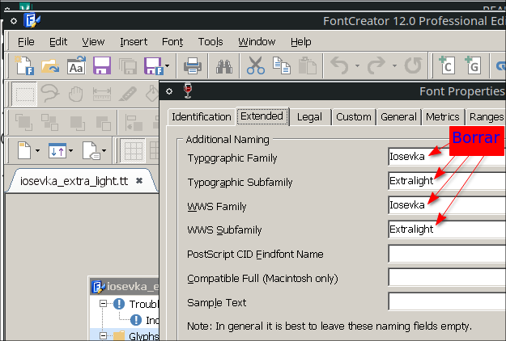
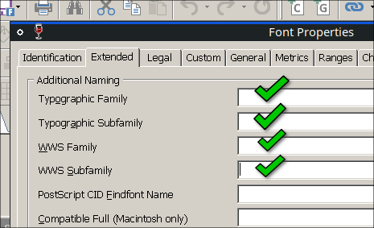
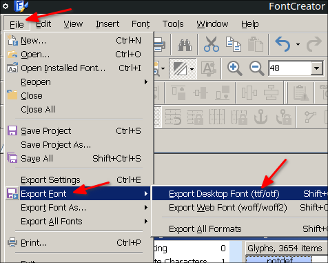
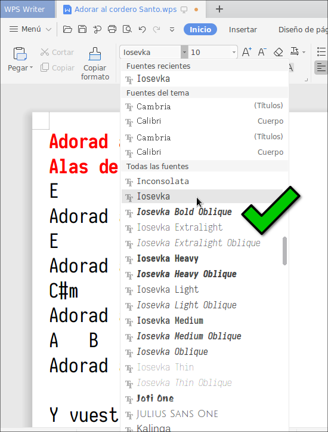

# Fonts-for-WPS-Office-Linux-2016-2019
Fix Fonts for WPS Office Linux 2016, 2019 that are recognized in Family font style popup menu

Estas fuentes las he arreglado para que WPS Office 2019 o 2016 Linux pueda reconocer las sub familias de las fuentes tipográficas

lo que he hecho es lo siguiente, con el programa:

**FontCreator**  
[https://www.high-logic.com/](https://www.high-logic.com/)  

he descargado la fuente iosevka de los repositorios de antiX:

[http://repo.antixlinux.com/bullseye/pool/main/f/fonts-iosevka/](http://repo.antixlinux.com/bullseye/pool/main/f/fonts-iosevka/)

[http://repo.antixlinux.com/bullseye/pool/main/f/fonts-iosevka/fonts-iosevka_1.14.1a-2~lboulard_all.deb](http://repo.antixlinux.com/bullseye/pool/main/f/fonts-iosevka/fonts-iosevka_1.14.1a-2~lboulard_all.deb)

Descomprimí el deb y abrí los archivos ttf con Font Creator y en:

Fonts &rarr; Properties

y donde aparecen las etiquetas en Extended:
&rarr;

borré todas las etiquetas y quedó así:

Clic en Aceptar y luego clic en:

File &rarr; Export Font &rarr; Export Desktop Font (ttf/otf)

esto hice con cada una de las fuentes:

fonts-iosevka_1.14.1a-2~lboulard_all/usr/share/fonts/truetype/iosevka/iosevka_bold.ttf
fonts-iosevka_1.14.1a-2~lboulard_all/usr/share/fonts/truetype/iosevka/iosevka_bold_italic.ttf
fonts-iosevka_1.14.1a-2~lboulard_all/usr/share/fonts/truetype/iosevka/iosevka_bold_oblique.ttf
fonts-iosevka_1.14.1a-2~lboulard_all/usr/share/fonts/truetype/iosevka/iosevka_extra_light.ttf
fonts-iosevka_1.14.1a-2~lboulard_all/usr/share/fonts/truetype/iosevka/iosevka_extra_light_italic.ttf
fonts-iosevka_1.14.1a-2~lboulard_all/usr/share/fonts/truetype/iosevka/iosevka_extra_light_oblique.ttf
fonts-iosevka_1.14.1a-2~lboulard_all/usr/share/fonts/truetype/iosevka/iosevka_heavy.ttf
fonts-iosevka_1.14.1a-2~lboulard_all/usr/share/fonts/truetype/iosevka/iosevka_heavy_italic.ttf
fonts-iosevka_1.14.1a-2~lboulard_all/usr/share/fonts/truetype/iosevka/iosevka_heavy_oblique.ttf
fonts-iosevka_1.14.1a-2~lboulard_all/usr/share/fonts/truetype/iosevka/iosevka_italic.ttf
fonts-iosevka_1.14.1a-2~lboulard_all/usr/share/fonts/truetype/iosevka/iosevka_light.ttf
fonts-iosevka_1.14.1a-2~lboulard_all/usr/share/fonts/truetype/iosevka/iosevka_light_italic.ttf
fonts-iosevka_1.14.1a-2~lboulard_all/usr/share/fonts/truetype/iosevka/iosevka_light_oblique.ttf
fonts-iosevka_1.14.1a-2~lboulard_all/usr/share/fonts/truetype/iosevka/iosevka_medium.ttf
fonts-iosevka_1.14.1a-2~lboulard_all/usr/share/fonts/truetype/iosevka/iosevka_medium_italic.ttf
fonts-iosevka_1.14.1a-2~lboulard_all/usr/share/fonts/truetype/iosevka/iosevka_medium_oblique.ttf
fonts-iosevka_1.14.1a-2~lboulard_all/usr/share/fonts/truetype/iosevka/iosevka_oblique.ttf
fonts-iosevka_1.14.1a-2~lboulard_all/usr/share/fonts/truetype/iosevka/iosevka_regular.ttf
fonts-iosevka_1.14.1a-2~lboulard_all/usr/share/fonts/truetype/iosevka/iosevka_thin.ttf
fonts-iosevka_1.14.1a-2~lboulard_all/usr/share/fonts/truetype/iosevka/iosevka_thin_italic.ttf
fonts-iosevka_1.14.1a-2~lboulard_all/usr/share/fonts/truetype/iosevka/iosevka_thin_oblique.ttf

y así las puede reconocer WPS, aquí una imagen:

WPS Office 2019 ahora reconoce las sub familias:

Iosevka Bold Oblique
Iosevka Extralight
Iosevka Extralight Oblique
Iosevka Heavy
Iosevka Heavy Oblique
Iosevka Light
Iosevka Light Oblique
Iosevka Medium
Iosevka Medium Oblique
Iosevka Oblique
Iosevka Thin
Iosevka Thin Oblique

Dios les bendiga

